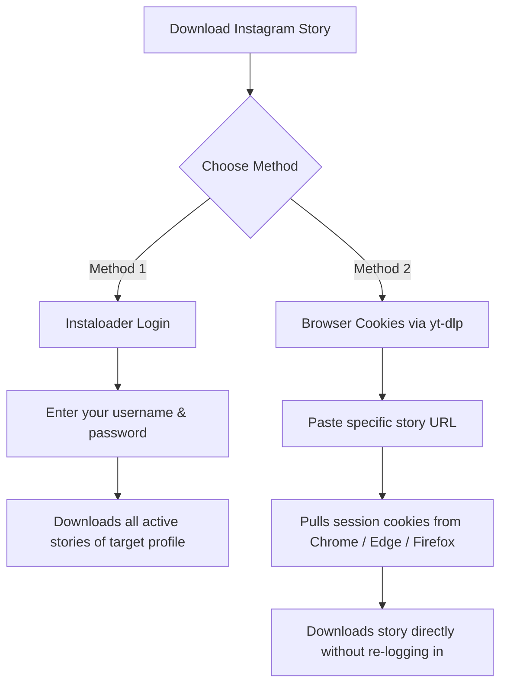

<div align="center">

# 🎬 Universal Media Downloader

**A fast, lightweight, and versatile CLI tool to download videos, audio, and stories from YouTube, Twitter/X, Instagram, TikTok, and 1000+ websites.**

[](https://www.python.org/)
[](https://github.com/)
[](https://github.com/yt-dlp/yt-dlp)
[](LICENSE)

[Features](#-key-features) • [Supported Platforms](#-supported-platforms) • [Installation](#-installation) • [Usage](#-usage) • [Instagram Stories](#-instagram-stories-guide) • [Disclaimer](#-disclaimer)

</div>

---

## ✨ Key Features

- 🎯 **Best Quality Video:** Automatically pulls and merges the highest resolution video (up to 4K/8K) and audio into `.mp4`.
- 🎵 **MP3 Audio Extraction:** Converts video soundtracks directly into high-quality 192kbps `.mp3` files.
- 📸 **Instagram Story Downloader:** Supports downloading active stories via Instagram account login or browser session cookies (Chrome, Edge, Firefox).
- ⚡ **Lightning Fast & Lightweight:** Built on top of `yt-dlp`, the leading media extraction library.
- 🖥️ **Cross-Platform:** Runs seamlessly on Windows, macOS, and Linux with an interactive terminal menu.

---

## 🌐 Supported Platforms

| Platform | Supported Formats | Quality / Notes |
| :--- | :--- | :--- |
| **YouTube** | Videos, Shorts, Music | Up to 8K, 60fps, MP3 extraction |
| **Twitter / X** | Videos, Clips, GIFs | Highest available bitrate |
| **Instagram** | Reels, Posts, Carousels, Stories | Stories require authentication |
| **TikTok** | Videos, Original Audio | Full HD, watermark-free where supported |
| **Reddit** | Videos with synced audio | Merges separated video/audio streams |
| **Twitch** | Clips, Highlights, VODs | Best stream quality |
| **Facebook** | Public Videos, Reels | High Definition MP4 |
| **SoundCloud** | Audio Tracks, Playlists | MP3 / Original audio |
| **1000+ Others** | Vimeo, Dailymotion, Pinterest, etc. | Supported via the `yt-dlp` core |

---

## 📦 Prerequisites

- **Python 3.8+** installed on your system.
- *(Recommended)* **FFmpeg** for video remuxing and MP3 conversion.
  - **Windows:** Run `winget install Gyan.FFmpeg` or download from [ffmpeg.org](https://ffmpeg.org/download.html).
  - **macOS:** `brew install ffmpeg`
  - **Linux:** `sudo apt install ffmpeg`

---

## 🚀 Installation

### 1. Clone the repository
```bash
git clone https://github.com/your-username/media-downloader.git
cd media-downloader
```

### 2. Install dependencies
```bash
pip install -r requirements.txt
```

---

## 💻 Usage

Run the main application:

```bash
python downloader.py
```

### Interactive Menu Preview:

```text
==================================================
     MEDIA DOWNLOADER (YouTube, Twitter/X, Instagram)
==================================================
1) Download Video (YouTube, Twitter/X, Instagram Reels/Posts, TikTok, etc.)
2) Download Audio Only - MP3 (YouTube, etc.)
3) Download Instagram Story
4) Open Downloads Folder
0) Exit
==================================================
```

### Example Commands & Flows:

#### 1. Download Video (Option `1`)
Paste any valid video URL when prompted:
```text
Enter video URL: https://www.youtube.com/watch?v=dQw4w9WgXcQ
[*] Fetching and downloading media...
[+] Download completed successfully: Rick Astley - Never Gonna Give You Up
[+] Saved to: ./downloads
```

#### 2. Extract Audio / MP3 (Option `2`)
Paste a video or music track URL:
```text
Enter URL for audio extraction: https://soundcloud.com/artist/track
[*] Fetching and extracting audio...
[+] Saved to: ./downloads/track_name.mp3
```

---

## 📸 Instagram Stories Guide

Because Instagram stories are restricted to authenticated sessions, this tool offers two reliable methods:



> [!NOTE]
> For private profiles, your account must already be an approved follower of that profile.

---

## 📂 Project Structure

```text
media-downloader/
│
├── downloader.py          # Interactive CLI application
├── requirements.txt       # Python dependencies (yt-dlp, instaloader)
├── README.md              # Project documentation
│
└── downloads/             # Auto-generated destination folder
    ├── Video_Title [ID].mp4
    ├── Audio_Track [ID].mp3
    └── instagram_stories/
        └── target_username/
            ├── 2026-09-20_story1.mp4
            └── 2026-09-20_story2.jpg
```

---

## 🤝 Contributing

Contributions, issues, and feature requests are welcome!
1. Fork the Project
2. Create your Feature Branch (`git checkout -b feature/AmazingFeature`)
3. Commit your Changes (`git commit -m 'Add some AmazingFeature'`)
4. Push to the Branch (`git push origin feature/AmazingFeature`)
5. Open a Pull Request

---

## ⚖️ Disclaimer

This tool is created for **personal, educational, and backup purposes only**. Downloading copyrighted content without permission may violate the terms of service of the respective platform. Always respect copyright laws and content creators' rights.

---

## 📄 License

Distributed under the MIT License. See `LICENSE` for more information.
